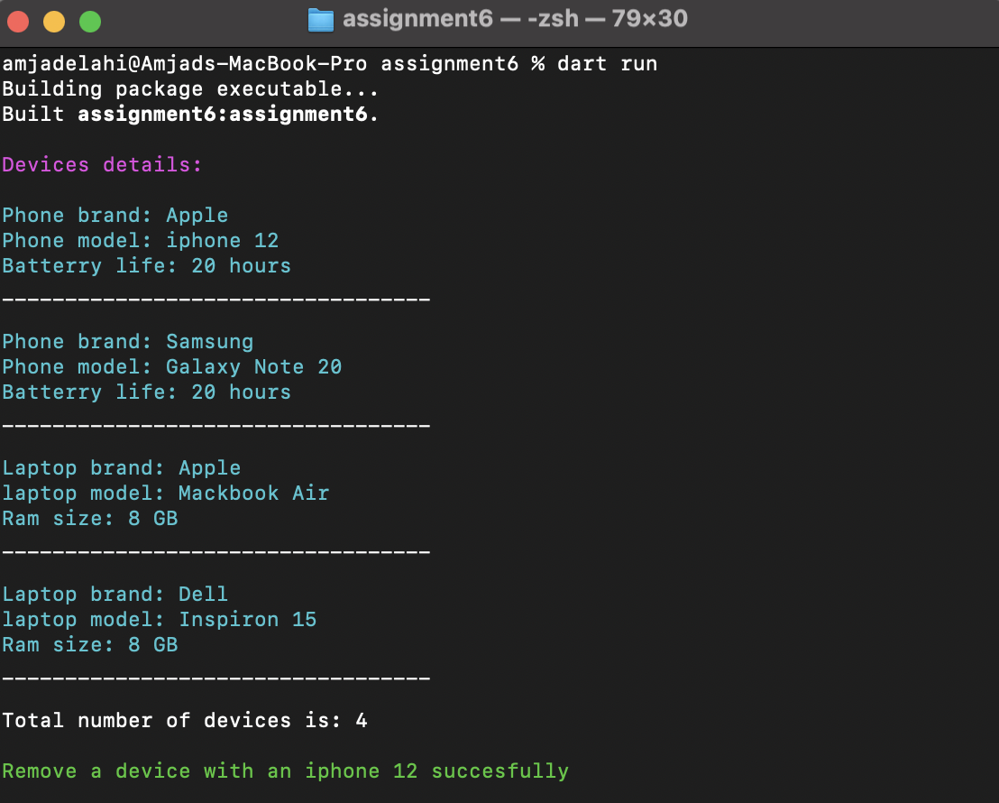
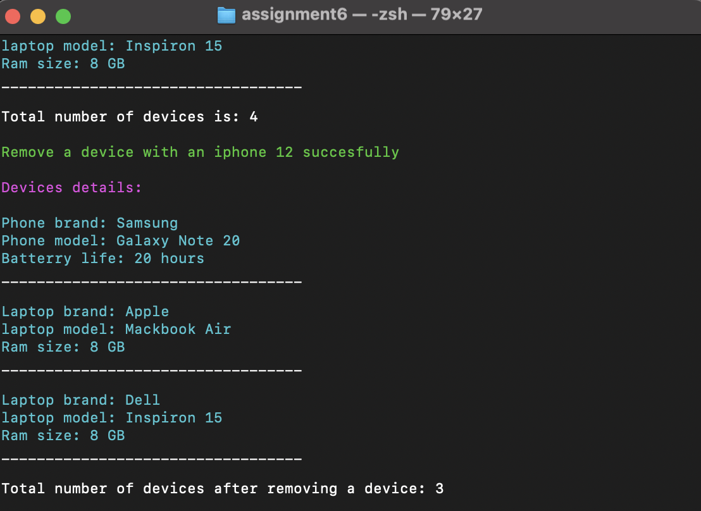
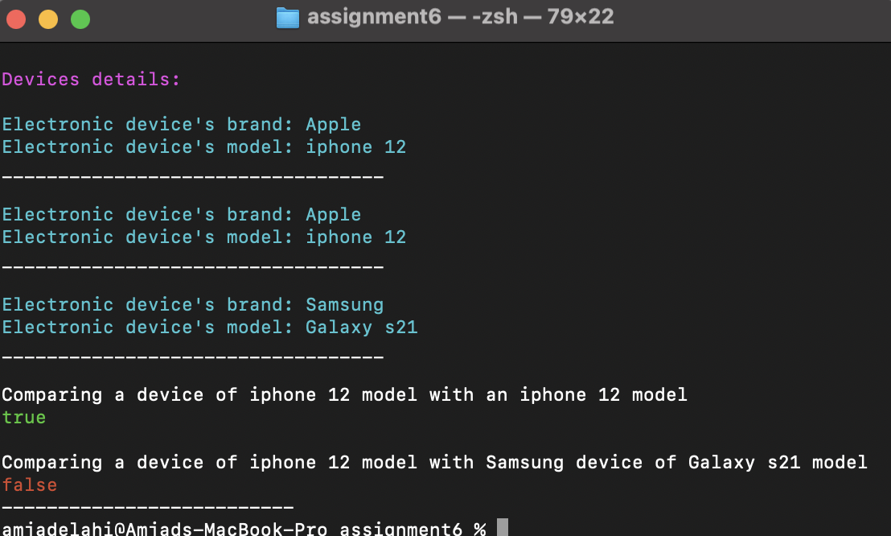

<p align="center">

<br/>

# Electronic Device Inventory System

## Description

 Enhance a basic inventory system to include methods for comparing devices and managing device counts and introduce an Inventory class to keep track of the devices.

## Requirements

 In order to run the application, this project requires a Dart SDK and a command line interface (CML).

## install dart SDK
 install dart SDK from [dart documentation](https://dart.dev/get-dart)

## How to run the project

1. Open terminal or CMD.
2. Navigate to the project path, such as 
```bash
cd /Users/amjadelahi/dart-bootCamp/Assignment-6/assignment6

```
 3. Run the application with a command: 
```bash
dart run
```
 4. The output should be like the following images:
      
* displaying the details of devices in the list and total number of devices in the list 
<p align="center">

<br/>

* displaying the details of devices in the list and total number of devices in the list after removing a device

<p align="center">

<br/>

* displaying the details of devices in the list in order to compare between two devices with electric device's model

<p align="center">

<br/>

