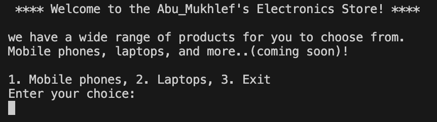
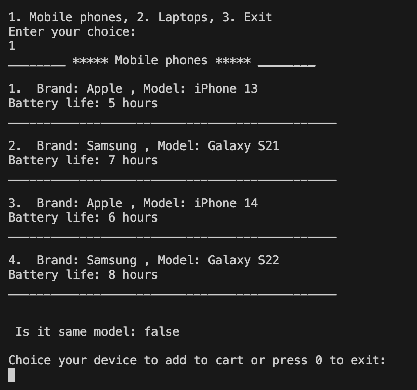
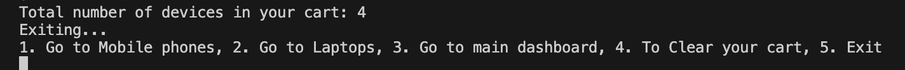

# Electronic Device Inventory System

### I have used a basic OOP for inventory system

# Electronic Device Inventory System :desktop_computer:
a simple store management system(my Store) :smiley:	

---

# It is imperative to verify that the <!--Links-->[Dart](https://dart.dev/)<!--Links--> language is installed on your machine before proceeding.

## Features
1. ###### Add Device to cart
3. ###### Delete Device from cart
4. ###### Display Display cart
5. ###### Compared  Devices's Model

## how to use it
* You **must** initially add an device to the cart, you must repeat this process every time you start. Why? Because we store in a list, not in a database, **so you must pay attention to that**.

___

### Abu_Mukhlef store

---
### choice devices numbers

### out put will be like this

---