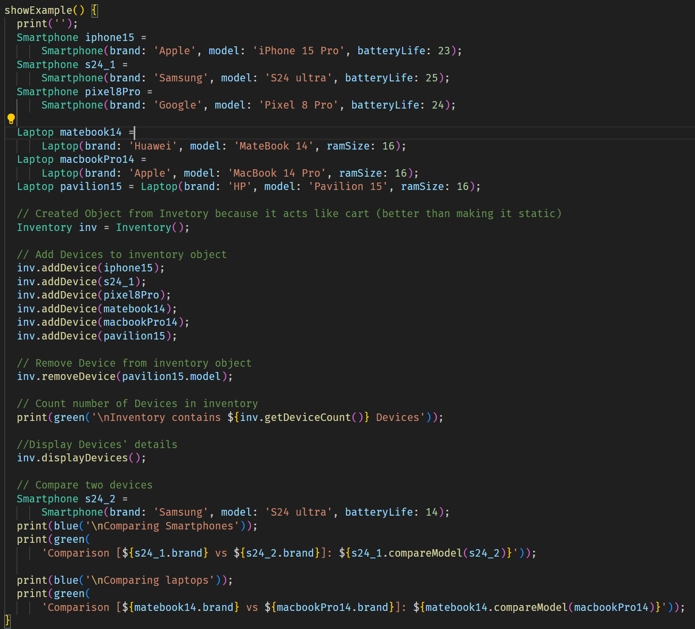
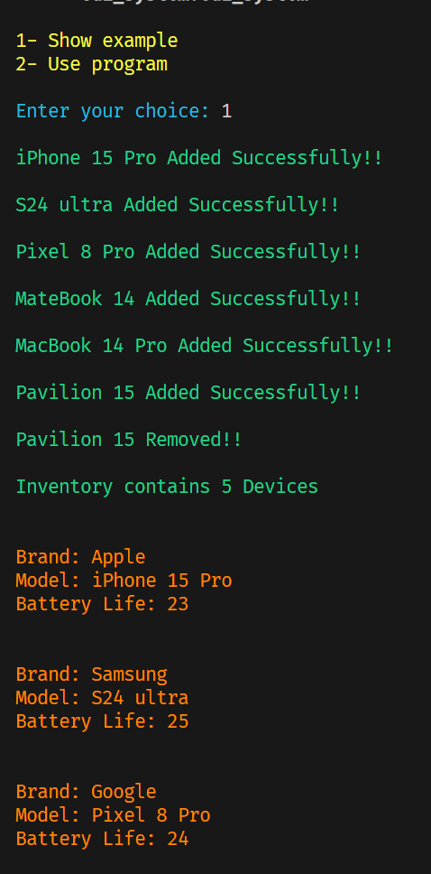
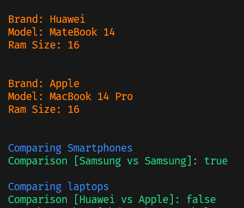
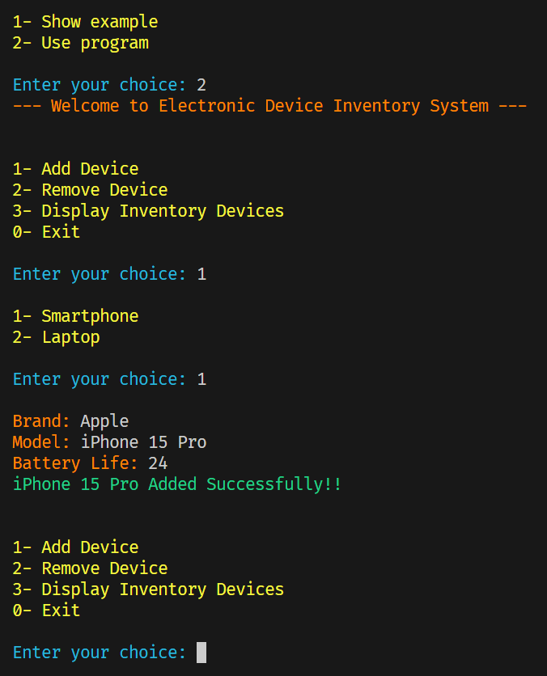

# Electronic Device Inventory System

The Electronic Device Inventory System is a console-based application built using Dart. It provides functionalities to add and remove devices (Smartphones or Laptops) to/from inventory (cart). It allows users to display devices' details in inventory.

### Features

- Add a new device to inventory
- Remove Device from inventory
- Compare two devices by model name
- Display device's details

# Instructions

## Choose 1 to show example written by developer

code:

output:

## Choose 2 to run the program and add, remove or display details.

