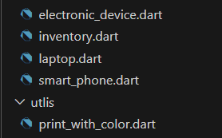
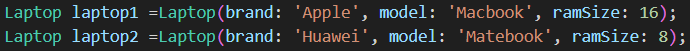
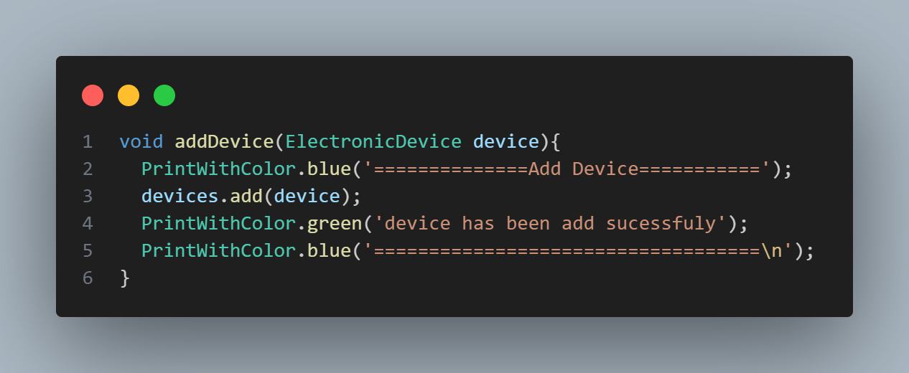
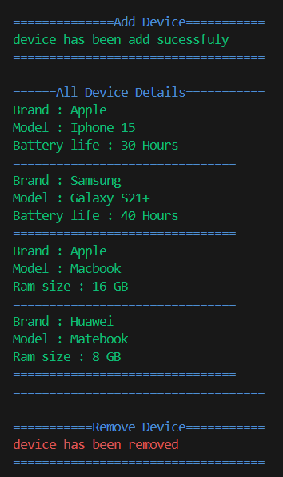
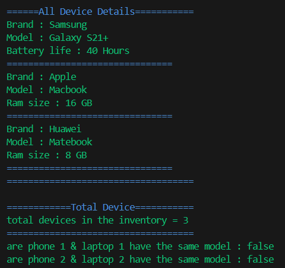

# Electronic Device Inventory System

## Description

basic inventory system project for practice OOP concept

## OOP Consept 

#### Class
the project contain 5 classes 

#### Objects
create objects in the project from class Laptop

#### Inheritance
class SmartPhone Inheritance from class ElectronicDevice

#### Polymorphism
add device method take object type ElectronicDevice since he is the parent for 
other classes so if the project want to add object from ElectronicDevice children 
there is no need to create another spicfic addDivice method for this object

## Main function

#### Add & remove

#### count & display

#### compare model 
it use Polymorphism to compare model from object to compare it with another

### Output

